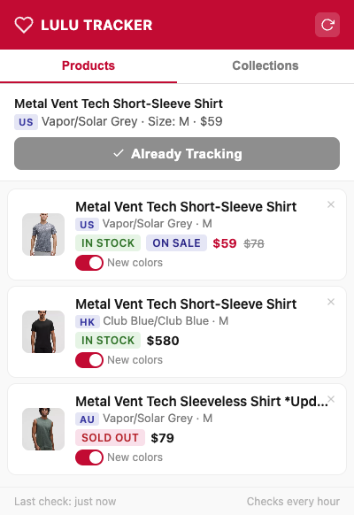
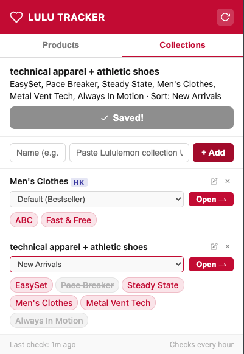
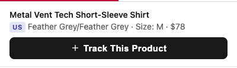
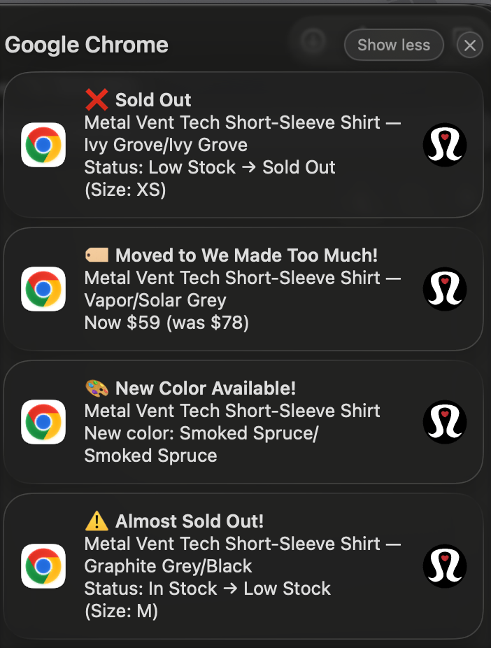

# Lululemon Product Tracker — Chrome Extension

A Chrome extension that tracks Lululemon product availability, price changes, stock status, and new color releases across **US**, **Hong Kong**, and **Australia** stores. Get desktop notifications when something changes — never miss a restock or price drop again.

  

---

## Features

### Product Tracking & Notifications

| Event | Notification |
|---|---|
| ⚠️ **Low Stock** | "Only a few left!" detected for your size |
| ❌ **Sold Out** | Your tracked product/size is no longer available |
| ✅ **Back in Stock** | A previously sold-out item is available again |
| 📉 **Price Drop** | Price decreased (shows old → new price) |
| 🏷️ **Went on Sale** | Product moved to "We Made Too Much" (US) |
| 🎨 **New Color** | A new color appeared for a product line you track |

### Multi-Region Support

| Region | Product Tracking | Collections | Currency |
|---|---|---|---|
| 🇺🇸 US (`shop.lululemon.com`) | ✅ Full support | ✅ Filter codes | USD |
| 🇭🇰 HK (`lululemon.com.hk`) | ✅ Full support | ✅ Filter names | HKD / NTD |
| 🇦🇺 AU (`lululemon.com.au`) | ✅ Full support | ✅ Filter names | AUD |

### Collection Shortcuts

Save your favorite filtered collection URLs as quick-access shortcuts:
- Save the current collection page with one click
- Toggle individual filters on/off to rebuild URLs dynamically
- Change sort method per collection (New Arrivals, Price, Top Sellers, etc.)
- Region-aware: different sort options for US vs HK vs AU

### Other Features

- **Badge count** on extension icon — shows how many products need attention
- **Per-product new color toggle** — enable/disable new color tracking per item
- **Change highlighting** — recently changed products get visual indicators
- **SPA navigation detection** — auto-refreshes when you switch color/size on the page
- **Privacy-first** — all data stays local, nothing sent to any server

---

## Screenshots

### Products Tab
<!-- Screenshot: The popup showing tracked products with status badges, prices, and region tags (US/HK/AU) -->


### Collections Tab
<!-- Screenshot: The collections tab with saved collections, filter chips, and sort dropdown -->


### Tracking a Product
<!-- Screenshot: Being on a Lululemon product page with the popup open showing "Track This Product" button -->


### Desktop Notification
<!-- Screenshot: A macOS/Windows notification showing a stock or price alert -->


---

## Installation

1. **Download** this repository:
   - Click the green **"Code"** button → **"Download ZIP"**, or
   - `git clone https://github.com/YOUR_USERNAME/lululemon-tracker.git`

2. **Unzip** the downloaded file (if using ZIP)

3. Open Chrome and go to `chrome://extensions/`

4. Enable **Developer mode** (toggle in the top-right corner)

5. Click **"Load unpacked"**

6. Select the `lululemon-tracker` folder

7. **Pin the extension** — click the puzzle piece icon in your toolbar → find "Lululemon Product Tracker" → click the pin 

> **Enable notifications:** Go to `chrome://settings/content/notifications` and make sure Chrome is allowed. On **macOS**, also check System Settings → Notifications → Google Chrome → Allow.

---

## How to Use

### Track a Product

1. Visit any product page on [lululemon.com](https://shop.lululemon.com), [lululemon.com.hk](https://www.lululemon.com.hk), or [lululemon.com.au](https://www.lululemon.com.au)
2. **Select your color and size** on the page
3. **Click the extension icon** in your toolbar
4. You'll see a preview of the detected product → click **"Track This Product"**
5. Done! The extension checks every hour automatically
6. Click the 🔄 button anytime to force an immediate check

### Save a Collection

1. Browse to a **filtered collection page** (e.g. Men's → Metal Vent Tech + Pace Breaker)
2. Click the extension icon → switch to the **Collections** tab
3. Click **"Save This Collection"**, or paste a URL manually
4. Your collection appears as a card with:
   - **Filter chips** — click any chip to toggle it on/off
   - **Sort dropdown** — change sort method (region-specific options)
   - **Open →** — opens the rebuilt URL with your active filters

### Understand the Status Badges

| Badge | Meaning |
|---|---|
| 🟢 `IN STOCK` | Available in your tracked color/size |
| 🟡 `⚠ LOW STOCK` | "Only a few left!" — act fast |
| 🔴 `SOLD OUT` | Unavailable in your tracked color/size |
| 🔵 `ON SALE` | Price reduced or moved to markdown |
| `US` `HK` `AU` | Which regional store this product is from |

---

## Testing

### Verify Installation

1. Open `chrome://extensions/` → find the extension → click **"Service Worker"**
2. You should see: `[LuluTracker] Extension installed. Alarm set.`

### Test Notifications

Run this in the Service Worker console:

```js
chrome.notifications.create('test', {
  type: 'basic',
  iconUrl: 'icons/icon128.png',
  title: '⚠️ Almost Sold Out!',
  message: 'Metal Vent Tech SS Shirt — Vapor/Solar Grey\nSize: M',
  priority: 2,
  requireInteraction: true,
});
```

### Inspect Tracked Data

```js
chrome.storage.local.get('trackedProducts', d => console.log(d))
```

---

## Project Structure

```
lululemon-tracker/
├── manifest.json      # Extension config (permissions, domains, icons)
├── background.js      # Service worker: scheduled checks, fetch, parsing, notifications
├── content.js         # Injected into product pages: extracts product data from DOM & JSON
├── popup.html         # Extension popup layout (Products + Collections tabs)
├── popup.css          # Styling (Lululemon-inspired theme)
├── popup.js           # Popup logic: product list, collection management, URL building
└── icons/
    ├── icon16.png     # Toolbar icon
    ├── icon48.png     # Extensions page icon
    └── icon128.png    # Install dialog icon
```

### Data Sources

| Site | Framework | Primary Data Source | Stock Detection |
|---|---|---|---|
| 🇺🇸 US | Next.js | `__NEXT_DATA__` JSON | SKU availability + server-rendered warnings |
| 🇭🇰 HK / 🇦🇺 AU | Salesforce Commerce Cloud | JSON-LD `ProductGroup` | `offers.availability` + visible low-stock banners |

### How Background Checking Works

```
Every hour:
  For each tracked product:
    1. Fetch the product page URL
    2. Parse structured data (__NEXT_DATA__ or JSON-LD)
    3. Extract: price, stock status, available colors
    4. Compare with stored state
    5. Send desktop notification if anything changed
    6. Update badge count on extension icon
```

---

## Important Notes

- **Selectors may break** — If Lululemon redesigns their site, CSS selectors and data structures may change. The extension uses multiple fallback strategies.
- **Rate limiting** — One `fetch()` per product per hour. Tracking ~50 products is fine.
- **Privacy** — All data stored locally in `chrome.storage.local`. No data is sent to any external server. No analytics, no tracking, no accounts.

---

## 免責聲明 Disclaimer

本擴充功能為個人專案，僅供學習與個人使用。

- 本擴充功能與 lululemon athletica inc. **沒有任何關聯**，亦未獲得其認可或授權。
- 「lululemon」名稱及商標為 lululemon athletica inc. 所有。
- 本工具僅讀取公開網頁資訊，不會繞過任何存取限制或驗證機制。
- 所有資料均儲存於使用者本機瀏覽器中（`chrome.storage.local`），**不會傳送至任何外部伺服器**。
- 作者不對因使用本工具而造成的任何損失負責，包括但不限於：錯過商品補貨、價格變動通知延遲或錯誤等。
- 使用者應自行承擔使用本工具之風險。
- 如果 lululemon 的網站結構發生變化，本擴充功能可能無法正常運作。

---

This is a personal project for learning and personal use only.

- This extension is **not affiliated with**, endorsed by, or associated with lululemon athletica inc.
- "lululemon" and all related trademarks are the property of lululemon athletica inc.
- This tool only reads publicly available web page data. It does not bypass any access restrictions or authentication mechanisms.
- All data is stored locally in the user's browser (`chrome.storage.local`). **No data is sent to any external server.**
- The author assumes no responsibility for any losses resulting from the use of this tool, including but not limited to: missed restocks, delayed or incorrect price change notifications, etc.
- Use at your own risk.
- This extension may stop working if lululemon changes their website structure.

---

## License

MIT License — feel free to fork, modify, and share.
